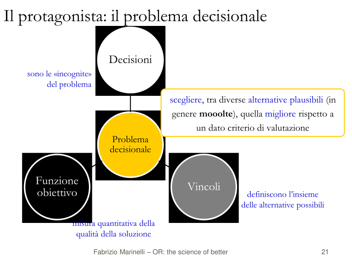
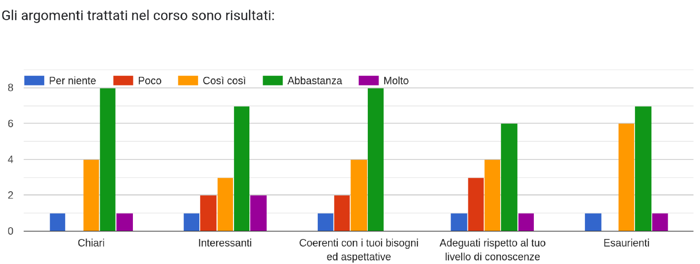
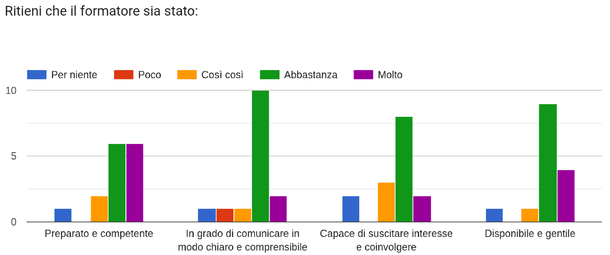
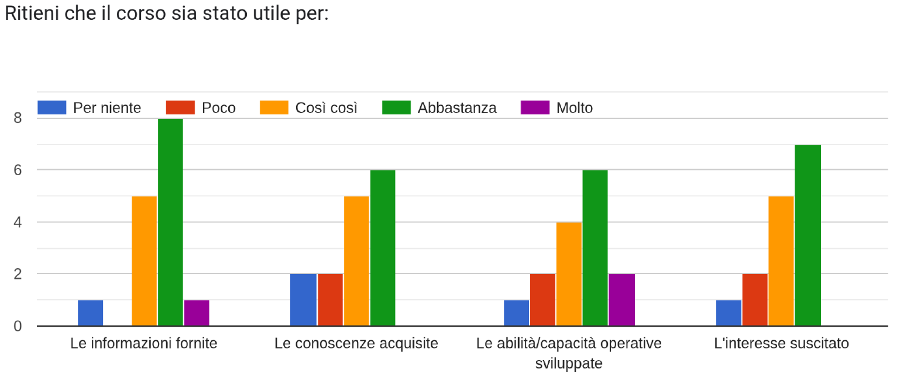

<Frontespizio />

<!--
Buon pomeriggio, sono Gionata Massi e ho l'onore di presentare l'esperienza didattica "Il Modello tra Problema e Soluzione: Un Percorso tra Competizione e Consapevolezza". Sebbene sia io qui ad illustrare il percorso didattico e la metodologia, questi sono opera del prof. Fabrizio Marinelli, che ho avuto il piacere di coinvolgere in una collaborazione tra l'IIS Savoia Benincasa, scuola secondaria di secondo grado in cui insegno, e l'Università Politecnica delle Marche.

Il titolo anticipa che l'esperienza è costruita per illustrare il ruolo centrale del **modello**, un concetto fondamentale per l'informatica che viene spesso trascurato nella didattica per andare velocemente a sviluppare, a volte senza neanche rifletterci adeguatamente, un algoritmo risolutivo. Con questo corso abbiamo voluto procedere a ritroso dall'algoritmo al modello, lavorando sull'astrazione e sulla formalizzazione.
Per insegnare a risolvere i problemi computazionali, abbiamo insegnato a descrivere il problema e, se non lo sappiamo già, scopriremo che una buona descrizione potrebbe essere sufficiente per farci calcolare una soluzione!

Il sottotitolo del corso, _Un Percorso tra Competizione e Consapevolezza_, sta ad indicare che la metodologia utilizzata si è avvalsa delle tecniche della **gamification**, per favorire il coinvolgimento, e di riflessione sul processo cognitivo, per favorire un'apprendimento significativo e persistente.

Le diapositive che vedete sono quelle presentate a Salerno il 5 ottobre, in occasione del terzo convegno ITADINFO, di cui vedete il logo in basso al centro di vari lucidi.
-->

---
layout: itadinfo
hideInToc: true
---

# Piano della Presentazione

<Toc text-sm minDepth="1" maxDepth="2" />

<!--
Vederemo in quale contesto, con quali risorse e quali vincoli, è stata sviluppata l'esperienza didattica; fisseremo gli obiettivi didattici trasversali e specifici; discuteremo della particolare metodologia didattica messa in atto, basata su problemi, che gli studenti sono chiamati a risolvere. Vedremo in quale modo abbiamo cercato di catturare l'attenzione e stimolare la riflessione. Abbiamo presentato alcuni problemi, che potere riconoscere tra alcuni classici problemi decisionali; svilupperemo la presentazione con l'esempio esteso dalla didattica del problema dello zaino, e concluderemo con un'analisi dei risultati ottenuti e dei possibili sviluppi.
-->

---
layout: itadinfo
---

# Contesto

- DM 65/2023
   - Potenziamento delle competenze STEM
   - Linee Guida per le discipline STEM
      - *Utilizzare metodologie attive e collaborative*
      - *Promuovere attività che affrontino questioni e problemi di natura applicativa.*
      - Utilizzare metodologie didattiche per un apprendimento di tipo induttivo.

> [...] promuovere l’integrazione, all’interno dei curricula di tutti i cicli scolastici, di attività, metodologie e contenuti volti a sviluppare le competenze STEM, digitali e di innovazione [...]
>
> **DM n. 65 del 12 aprile 2023**...

- IIS Savoia Benincasa, Ancona
   - IT *Economico*, AFM art. *Sistemi Informativi Aziendali*, Classe *V*
- Università Politecnica delle Marche
   - Prof. Fabrizio Marinelli

<!-- Il percorso didattico è nato quando l'IIS Savoia Benincasa, scuola in cui insegno informatica nell'Istituto Tecnico Economico, ha ricevuto il finanziamento dal DM 65/2023 sul potenziamento delle competenze STEM, Science, Tecnology, Engineering and Mathematics. Mi sono trovato coinvonto nella progettazione e, sebbene nell'acronimo STEM non compaia esplicitamente la Computer Science/Informatics, ho cercato un modo per recuperare la nostra disciplina in un'ottica d'integrazione con le altre.

C'era da progettare un corso con vincoli disciplinari ma anche metodologici, come definito dalle Linee Guida per le discipline STEM. Esse richiedono di *Utilizzare metodologie attive e collaborative* e di *Promuovere attività che affrontino questioni e problemi di natura applicativa.*.

Per inciso e con piacere, faccio notare che le linee guida citano le *Indicazioni Nazionali per l'insegnamento dell’Informatica nella Scuola* proposte dal CINI nel 2017. Un riconoscimento importante per la nostra disciplina e per il lavoro svolto dal prof. Nardelli!

La scelta del "gruppo target", presa in collaborazione con i vari dipartimenti della scuola, è stata quella della classe V dell'IT Economico indirizzo AFM art. Sistemi Informativi Aziendali. Le materie oggetto della seconda prova dell'Esame di Stato per questa articolazione avrebbero potuto essere Economia Aziendale oppure Informatica, e al colloquio probabilmente avrebbero avuto un commissario di Matematica Applicata interessato alla Ricerca Operativa. Gli insegnanti di matematica degli Istituti Tecnici sono infatti inquadrati nella Classe di Concorso "A47 - Scienze matematiche applicate". -->

---
layout: itadinfo
---

# Obiettivi

- Trasversali
   - Integrare le competenze in Informatica con quelle di Matematica ed Economia
   - Motivare lo studio verso le discipline STEM
   - Promuovere attività che affrontino problemi e questioni di natura applicativa
- Disciplinari
   1. Astrarre le caratteristiche comuni di un problema decisionale (di scelta)
   2. Scoprire metodi euristici e/o algoritmi esatti per risolvere problemi
   3. Valutare l'efficienza degli algoritmi in termini di tempo di calcolo
   4. Formulare modelli per risolvere problemi decisionali

<!-- Sugli obiettivi trasversali siamo rimasti nell'ambito del DM 65.
Ci siamo orientati nell'intersezione delle competenze tra Matematica applicata e l'Informatica cercando anche un legame con il mondo dell'Economia nella scelta dei contenuti. 

La competenza su cui ci siamo concentrati maggiormente è quella di astrazione dal problema concreto per passare al modello e da qui raggiungere una soluzione in modo efficiente. Lo studente, dopo aver lavorato con alcuni problemi, dovrebbe iniziare a capire come togliere dettagli, inutili alla fine del calcolo della soluzione, ad un problema decisionale, riconoscendo una struttura comune ai problemi decisionali. Questo è il passo di astrazione.

Prima di astrarre il primo modello, però, abbiamo lavorato sugli algoritmi che gli studenti sapevano già descrivere, spero in conseguenza di due anni di lezioni di Informatica. Gli studenti erano già in grado di sviluppare strategie euristiche, come gli approcci Greedy (golosi). Abbiamo anche guidato la scoperta di algoritmi esatti. 

La seperimentazione degli algoritmi esatti naive però ci ha portato all'intrattabilità computazionale. Abbiamo un algoritmo, ma non abbiamo il tempo per aspettare che esso termini.
Questo è un punto cruciale che si lega a quanto discusso due settimane fa da Nicola Dalla Pozza: il primo 'Inverno dell'Intelligenza Artificiale' fu causato proprio dalla sottovalutazione della complessità computazionale. Molte promesse dell'IA si infransero contro algoritmi che, pur teoricamente corretti, richiedevano tempi di calcolo esponenziali.
Capire questo limite è fondamentale: l’inefficienza di un algoritmo può essere un ostacolo che impedisce la risoluzione di un problema gestionale o scientifico ma anche una risorsa (pensiamo alla crittografia che protegge i nostri dati).

A fine corso fine corso gli studenti dovrebbero essere in grado di astrarre le caratteristiche comuni a tutti i problemi decisionali, e di descrivere formalmente un modello astratto per descrivere intere _classi_ di problemi in termini di _variabili_, _obiettivo_, e _vincoli_. Un linguaggio di dominio specifico ed un risolutore  

 -->

---
layout: itadinfo
---

# Metodologia didattica

Una sintesi di:

- *Gamification*
- *Lezione segmentata*
- *Problem-Based Learning* 
- Attenzione ai processi metacognitivi

<!-- La metodologia didattica sviluppata per questo corso integra elementi ed idee derivate da varie teorie e pratiche didattiche:

- per aumentare il coinvolgimento e la partecipazione attiva degli studenti abbiamo usato la tecnica della *gamification*, con gare e classifiche,
- abbiamo usato la tecnica della *lezione segmentata*; questa consiste nel proporre attività brevi piuttosto che lunghe spiegazioni teoriche. Lo scopo è quello di massimizzare efficacia didattica nel rispetto dei tempi di attenzione degli studenti; tra un paio di lucidi si vedrà quali sono i nostri segmenti.
- abbiamo utilizzato problemi reali e complessi come punto di partenza per l'apprendimento, dividendo gli studenti in piccoli gruppi collaborativi come nel *Problem-Based Learning*, una metodologia che è stata sviluppata per le scienze sperimentali e la medicina. La presentazione degli argomenti per problemi è però molto diffusa anche nella _Ricerca Operativa_ e nel _Calcolo Numerico_.
- infine, abbiamo cercato di stimolare costantemente gli studenti alla riflessione sul processo di apprendimento, tra continui *active recall* forzati con questionari di valutazione formativa, frequenti domande con richieste di spiegazione agli studenti e tramite un meccanismo di bonus/malus nel sistema di gioco, che abbiamo impropriamente chiamato *scommessa* nell'articolo. Con *active recall* intendiamo la tecnica di studio basata sul forzare il cervello a recuperare le informazioni senza consultare il materiale di studio al fine di migliorare la capacità di ricordare a lungo termine. Sebbene la tecnica sia di studio, noi abbiamo cercato di forzarla con i quiz - che concorrono alla formazione del punteggio nel gioco - dove abbiamo richiesto a breve distanza dalla presentazione di fornire risposte su quanto esposto, sia con domande sia con concetti sviluppati negli anni precedenti nelle lezioni di Informatica. -->

---
layout: default
---

## Regole del gioco

   {width=70%, title="Regole del gioco"}

<!-- 
In questa diapositiva manca il logo ITADINFO. Slide come questa sono quelle usate a lezione come materiale didattico che ha guidato lo svolgimento del corso.

Questo corso è stato presentato come un gioco - tecnica della _ghèim-i-fi-kéi-shən_, la competizione del titolo -  in cui ogni partecipante ha una dotazione iniziale di 1000 *dobloni* e guadagna dobloni rispondendo correttamente a domande individuali. I partecipanti collaborano in una piccola squadra alla risoluzione di problemi e, insieme al proprio gruppo, possono *scommetterne*/*investirne* da 10 a 200 dobloni sulla qualità della propria soluzione, con la possibilità di incrementare o ridurre la propria dotazione in base all'esito.

Per l'esperienza descritta, sono state formate quattro squadre di quattro studenti ciascuna, con composizione casuale e costante per tutta la durata del corso.

Il sistema di feedback con i nomi degli studenti, i gruppi, il punteggio dei singoli e il punteggio della squadra, dato dal punteggio medio degli studenti della squadra, è stato realizzato con un foglio di calcolo condiviso. -->

---
hideInToc: true
layout: default
---

## Un gioco pieno di problemi!

   {width=65%, title="Fasi didattiche"}

<!-- La progressione didattica, molto approssimativamente, è quella presentata nel diagramma.

Si procede per problemi.

Il problema viene introdotto brevemente, con definizione dei termini e dei concetti di base.

Segue immediatamente una verifica dei concetti appena esposti con la richiesta di attivarsi per ripetere e consolidare la conoscenza, ad esempio tramite quiz.

Il sistema di feedback fornisce il meccanisco per *capire se ho capito*.

Abbiamo favorito poi una discussione aperta a tutta la classe per verificare che tutti gli studenti avessero acquisito i concetti di base.

Il formatore arriva al momento della presentazione della soluzione *naïf*. Un algoritmo che RISOLVE ESATTAMENTE il problema.

Lo studente dovrebbe sentirsi in grado di affrontare un problema reale!

Viene quindi proposto un problema realistico, spesso solo aumentando le dimensioni dell'istanza del problema giocattolo. Gli studenti lavorano in gruppo per un tempo di circa 25/30 minuti, trovano una soluzione e la consegnano.
Aggiungo un dettaglio: l'algoritmo naïf non può fornire una soluzione in tempo ragionevole perché lo spazio di ricerca è troppo grande oppure ha una rappresentazione che è in dominio continuo, composto da infinite soluzioni non ottime. Il gruppo sperimenta l'intrattabilità computazionale di un problema di cui non conosce un algoritmo risolutivo efficiente.

Dopo la consegna hanno 5/10 minuti per valutare la loro soluzione e scegliere il bonus/malus.

Al termine viene richiesto ad ogni gruppo di dire come hanno risolto il problema e come hanno valutato la loro soluzione. La classifica viene aggiornata ma resta l'incognita di conoscere quale sia la migliore soluzione possibile. Siamo nello stato del **Problem Not Solved** del *Necessity Learning Design* di Michael Lodi.

È questo il momento del formatore che illustra il modello e/o l'algoritmo. Per CERTIFICARE l'ottimalità della soluzione si è fatto ricorso alla programmazione dichiarativa con i linguaggi della Programmazione Lineare e Programmazione Lineare Intera e l'uso di un *risolutore* che ci fornisce la soluzione ottima cercata. 
-->

---
layout: itadinfo
---

## Successione dei problemi

- Problema dello zaino
- Problema del rettangolo isoperimetrico di area massima
- Problema dello zaino (seconda iterazione)
- Problema del mix ottimo di produzione
- Problema della dieta di costo minimo

<!-- Si presentano alcuni problemi. Ogni problema può essere affrontato con un livello di dettaglio diverso, con un approccio a SPIRALE, come vedremo nel caso del problema dello zaino.
I problemi sono classici problemi di decisione. -->
---
layout: default
---

## Fasi didattiche: il Problema dello Zaino

   {width=70%, title="Introduzione - Problema dello Zaino"}

<!-- L'introduzione del problema avviene in modo semplice, con riferimente al quotidiano o a esperienze più o meno familiari. Qui vedete un esempio. Non ho ancora formalismi. -->

---
layout: default
---

### Problema dello Zaino - Sfida individuale

   {width=70%, title="Sfida individuale - Problema dello Zaino"}

<!-- Per rendere attiva la lezione si usano tecniche di *active recall* inserite nel contesto della gamification. Nell'esperienza è stato usato *WooClap* per gestire le risposte. Vedrete il logo di WooClap in molte slide,  -->

---
layout: default
---

### Problema dello Zaino - Sfida di gruppo

   {width=70%, title="Sfida di gruppo - Problema dello Zaino"}

<!-- Questa è la sfida di gruppo, che nella progressione reale dell'esperienza era stata proposta prima della soluzione naïf.
Il QR code permetteva di scaricare i dati dei 50 oggetti in un foglio di calcolo. -->

---
layout: default
---

### Problema dello Zaino - Discussione

   {width=70%, title="Discussione - Problema dello Zaino"}

<!-- È stato un problema utile ai fini didattici?
Sì! Ha portato alla scoperta delle euristiche, in questo caso degli ALGORITMI GOLOSI.
Sono emerse strategie risolutive, euristiche appunto!, per cui gli studenti tutti hanno applicato criteri di ordinamento dei dati, per profitto, per peso e per il rapporto tra profitto e peso.
Non conoscono concetti avanzati come *regole di dominanza* e *oggetti dominati*, *limitanti*, *algoritmi esatti*... 
-->

---
hideInToc: true
---

### Problema dello Zaino - Discussione - 2

   {width=70%, title="Discussione - Problema dello Zaino"}

---
hideInToc: true
---

## Verso il modello astratto

   {width=70%, title="Il modello della programmazione matematica"}

---
hideInToc: true
---

## Rettangolo isoperimetrico

   {width=70%, title="Introduzione - Rettangolo isoperimetrico"}

---
layout: default
---

### Problema dello Zaino - Soluzione naïf

   {width=70%, title="Soluzione naïf - 1 - Problema dello Zaino"}

<!-- Questo è il momento dell'algoritmo di risoluzione esatta che risolve il problema giocattolo ma non risolve il problema reale. Gli studenti però questo ancora non lo sanno, o almeno non lo sanno per il primo problema presentato. Nel caso specifico del problema dello zaino, però, la soluzione naïf è stata posticipata dopo aver visto un altro problema-->

---
layout: default
---

### Problema dello Zaino - Spazio delle soluzioni

   {width=70%, title="Soluzione naïf - 2 - Problema dello Zaino"}

<!-- Questa è l'illustrazione del spazio delle soluzioni.
La slide è stata usata anche riattivare gli schemi cognitivi relativi a:

- tipo boolean
- array di boolean
- codifica binaria
- numero di configurazioni distinte di $n$ cifre binarie
 -->

---
layout: default
---

### Problema dello Zaino - Verso il modello

   {width=70%, title="Spiegazione - Problema dello Zaino"}

<!-- Dopo circa 6 ore e, dopo anche una simulazione dell'enumerazione totale delle $2^50$ soluzioni che gira per ore prima di essere interrotta, si arriva al momento di costruire il modello per risolvere il problema. È un processo complesso che la prima volta è molto guidato. -->

---
layout: default
---

### Problema dello Zaino - Il modello

   {width=70%, title="Spiegazione - Problema dello Zaino"}

<!-- Alla fine si giunge alla formulazione secondo il modello della Programmazione Lineare Intera.

Il logo che si vede in basso è quello di CoLab.

Con CoLab viene tradotto il modello matematico usando il linguaggio AMPL e viene risolto il problema.

La soluzione ottima vale 196. Il miglior valore trovato dagli studenti con l'euristica golosa basata sulla densità.
-->

---
layout: itadinfo
---

### Apprendere dal "Problema dello Zaino"

- Astrazione
   - del problema
- Rappresentazione
   - del problema -> MODELLO
   - codifica dell'istanza
   - codifica (e spazio) delle soluzioni
- Algoritmi
   - esatti (enumerazione totale) ed euristici (greedy)
   - complessità temporale: crescita esponenziale
   - esistenza di risolutori per classi di problemi
- Linguaggi
   - Programmazione Lineare Intera (PLI)
   - A Mathematical Programming Language (AMPL)

<!-- Cosa hanno imparato. Tutto quello che leggete nella diapositiva! -->

---
layout: itadinfo
---

# Percezione degli studenti

...i voti, nella scala di Likert, che ci hanno dato gli studenti

<!--
Sebbene gli argomenti trattati siano complessi, la distribuzione delle risposte indica una buona progettazione e una modalità didattica efficace:

- *Chiarezza e Interesse*: La maggior parte degli studenti si attesta su giudizi "Abbastanza" o "Molto". Questo dimostra che la segmentazione della lezione e l'approccio problem-based hanno reso accessibili temi avanzati come il Problema dello Zaino e la Programmazione Lineare.
- *Coerenza con le aspettative*: La prevalenza di giudizi positivi suggerisce che il corso sia stato percepito come un utile potenziamento delle competenze STEM , riuscendo a collegare la teoria (matematica) alla pratica operativa (informatica/modellazione).
-->

---
layout: itadinfo
hideInToc: true
---

## Giudizio degli studenti

<!--
- *Capacità di Coinvolgimento*: Nonostante la densità tecnica, la maggior parte dei partecipanti riconosce al formatore la capacità di averli coinvolti. Questo è il risultato diretto dell'uso della *gamification* e del sistema a premi, che ha trasformato la lezione in un *serious game*.

-->
---
layout: itadinfo
hideInToc: true
---

## Giudizio degli studenti

<!--

Sviluppo di Competenze e Utilità
L'utilità del corso è evidente se letta attraverso la lente delle competenze trasversali:

*Problem Solving Operativo*: Gli istogrammi sulle abilità sviluppate mostrano che gli studenti hanno apprezzato il "saper fare". Le sfide di gruppo hanno permesso di passare dalla teoria alla formalizzazione di variabili e vincoli.

*Metacognizione*: Il meccanismo della scommessa ha spinto gli studenti a riflettere criticamente sulle proprie soluzioni, un risultato educativo raro che va oltre la semplice memorizzazione di formule.

**Analisi Qualitativa della Soddisfazione**
Se guardiamo ai commenti positivi come "i lavori di gruppo" e "gli esempi", emerge un quadro di soddisfazione per la modalità attiva:

-->
---
layout: itadinfo
---

# Conclusioni

- Didattica disciplinare
   - Dal problema alla soluzione tramite la costruzione del Modello
   - Risoluzione di problemi reali
- Metodologia didattica
   - Attiva, efficace e motivante
   - Attivazione processi metacognitivi
- Estendibilità ad altri ambiti
   - programmazione
   - basi di dati
   - ingegneria del software

<!--
Gli studenti hanno:
- consolidato schemi propri dei concetti informatici,
- scoperto come i problemi possano essere formulati secondo modelli
- problemi concreti simili possono essere istanze di uno stesso modello
- scoperto l'intrattabilità computazionale

A livello di metodologia didattica:
- buona percezione da parte degli studenti di aver appreso nuovi concetti
- senso di utilità delle competenze apprese
- crediamo di aver stimolato l'apprendimento in modo attivo e significativo

Il modello didattico ci sembra facilmente replicabile in altri ambiti.
- didattica dei linguaggi di programmazione, nella quale procedere con problemi che aggiungono pattern strutturali comuni
- nello sviluppo di modelli di dati, pensando alle ristrutturazioni del modello concettuale in logico, oppure la storicizzazione dei dati
- in ingegneria del software, dove i problemi potrebbero essere quelli categorizzati nei "Design Patterns"
-->

---
hideInToc: true
layout: default
---

<RetroFrontespizio />

---
hideInToc: true
---

# Materiali

 - Diapositive del corso (PDF):
    - Prima parte ([formato PDF](./assets/0_SavoiaBenincasa.pdf))
    - Seconda parte ([formato PDF](./assets/1_SavoiaBenincasa.pdf))
 - Diapositive per il webinar: [sito web](https://gionata.github.io/il-modello-tra-problema-e-soluzione-pif/)
 - Diapositive per il webinar: [formato PDF](./assets/presentazione.pdf) 
 - Pre-print articolo ITADINFO 2025: [formato PDF](./assets/preprint.pdf)
 - Notebooks:
   - Problema dello zaino - enumerazione su problema "giocattolo" [Jupyter Notebook](./assets/zaino_1.ipynb)
   - Generazione degli elementi dell'insieme delle parti [Jupyter Notebook](./assets/insieme_delle_parti.ipynb)
   - Problema dello zaino - enumerazione della "gara 1" [Jupyter Notebook](./assets/zaino_2.ipynb)
   - Problema dello zaino - algoritmi greedy per "gara 1" [Jupyter Notebook](./assets/zaino_3.ipynb)
   - Problema dello zaino - modello AMPL per la "gara 1"  [Jupyter Notebook](./assets/zaino_gara_1_AMPL.ipynb)
   - Problema dello zaino - modello AMPL per la "gara 1" [Colab](https://colab.research.google.com/drive/1xyJTwHsh4iEpl5US78S2Ub8KV5afkjBK)

---
layout: itadinfo
hideInToc: true
---

### Sviluppi futuri

- Revisione delle tecniche di gamification e versione online (Moodle) del sistema di feedback
- Repliche del corso, anche in altri indirizzi, esteso a problemi formulati su grafi
- Monitoraggio dell'efficacia didattica con raccolta di dati per analisi e miglioramenti
   - Pre/Post-test di apprendimento cognitivo
   - Revisione quesiti di coinvolgimento e gradimento

<!--  -->

---
hideInToc: true
---

### Problema dello Zaino - Spiegazione e MODELLO - 1

   {width=70%, title="Spiegazione - Problema dello Zaino"}

---
hideInToc: true
---

### Problema dello Zaino - Spiegazione e MODELLO - 3

   {width=70%, title="Spiegazione - Problema dello Zaino"}

---
hideInToc: true
---

### Problema dello Zaino - Spiegazione e MODELLO - 4

   {width=70%, title="Spiegazione - Problema dello Zaino"}

---
hideInToc: true
---

### Problema dello Zaino - Spiegazione e MODELLO - 5

   {width=70%, title="Spiegazione - Problema dello Zaino"}

---
hideInToc: true
---

### Problema dello Zaino - Spiegazione e MODELLO - 6

   {width=70%, title="Spiegazione - Problema dello Zaino"}

---
layout: itadinfo
hideInToc: true
---

### Rettangolo isoperimetrico - Concetti chiave

- Astrazione
- Rappresentazione
   - del problema -> MODELLO
   - discretizzazione spazio delle soluzioni
   - codifica dell'istanza discretizzata 
   - codifica delle soluzioni e simmetria
- Algoritmi
   - simulazione: iterazione con ricerca del massimo
   - soluzione algebrica (cond. primo e secondo ordine derivate)
- Linguaggi
   - A Mathematical Programming Language (AMPL)

---

## Mix ottimo di produzione

   {width=70%, title="Introduzione - Mix ottimo"}

---

## Problema della dieta

   {width=70%, title="Introduzione - Problema della dieta"}

---
layout: itadinfo
hideInToc: true
---

### Problema della dieta - Concetti chiave

- Astrazione
- Rappresentazione
   - del problema -> MODELLO
- Algoritmi
   - algoritmi greedy
   - cenni al metodo del simplesso
- Linguaggi
   - A Mathematical Programming Language (AMPL)
